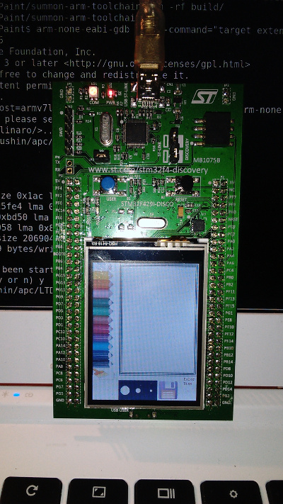

## `STM32F429I-DISCOVERY` LTDC_Paint sample for Linux with GCC and Make

This is a port of STMicroelectronics `LTDC_Paint` sample application for `STM32F429I-DISCOVERY` board. The sample originally offered for EWARM/MDK-ARM/TrueSTUDIO is adopted for compilation on Linux with GCC and GNU make. The sample presents a basic painting program with GUI on board's LCD touchscreen.



Checkout sample source code and dependencies:

```
$ git clone https://github.com/apc-llc/LTDC_Paint
$ cd LTDC_Paint
$ git submodule init
$ git submodule update
```

## How to build

### Build & install `stlink`:

```
$ cd stlink/
$ ./autogen.sh 
$ mkdir build
$ cd build/
$ sudo apt-get install libusb-1.0-0-dev
$ ../configure --prefix=$(pwd)/../../install
$ make -j12
$ make install
```

### Build & install the GCC toolchain:

```
$ cd summon-arm-toolchain
$ sudo apt-get install build-essential git flex bison libgmp3-dev libmpfr-dev libncurses5-dev libmpc-dev autoconf texinfo libtool libftdi-dev libusb-1.0-0-dev libexpat-dev
$ ./summon-arm-toolchain PREFIX=$(pwd)/../install CPUS=4
```

### Build the `LTDC_Paint` sample:

```
$ cd LTDC_Paint
$ export PATH=$(pwd)/install/bin:$PATH
$ make TOOLCHAIN=gnu
```

### Debug

In order to debug the `LTDC_Paint` sample on `STM32F429I-DISCOVERY` device, open another terminal and launch the gdb server plugin:

```
$ cd LTDC_Paint
$ sudo bash -c "PATH=$(pwd)/install/bin:$PATH st-util"
```

Now, from the main terminal window launch the gdb client:

```
$ cd LTDC_Paint
$ export PATH=$(pwd)/install/bin:$PATH
$ arm-none-eabi-gdb -eval-command="target extended-remote :4242" ./lcd
$ load
$ run
```

After screen calibration message, ``STM32F429I-DISCOVERY` device should display the main window of the paint program.

